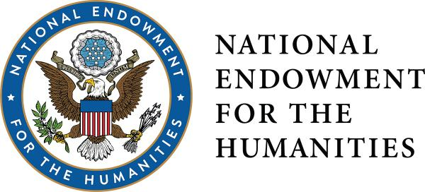
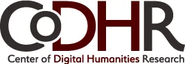

# Advanced digital editing: modeling the text and making the edition
## NEH Institute for Advanced topics in the Digital Humanities 2020

### Rationale
Digital humanists already have access to workshops and tutorials to help them learn to transcribe, edit, and tag a text in preparation for publishing a digital edition. Nonetheless, sophisticated markup expertise alone is not enough to make an edition, and learning nothing more than tagging may leave scholars staring at their angle brackets and wondering what to do next. Digital humanists cannot build editions that break methodological ground solely on the basis of solutions prepared largely by others, and the focus of this Institute is on the creation of digital editions motivated by project-specific research questions and implemented from a perspective driven first by theory of edition, second by editorial methodology, and necessarily but less importantly by specific toolkits. In this respect, this Institute recognizes thinking digitally in ways driven by project-specific research goals as the most important feature of sustainable Digital Humanities training and education.

### Acknowledgements
<table style="border: none;">
    <tr style="border: none;">
        <td style="border: none;">
            
        </td>
        <td style="vertical-align: middle; border: none;"><em>Advanced digital editing: modeling the
                text and making the edition</em> is awarded by the NEH Office of Digital Humanities
            (ODH) and co-funded by the NEH Division of Research Programs. Any views, findings,
            conclusions, or recommendations expressed in materials developed for this project do not
            necessarily represent those of the National Endowment for the Humanities.</td>
    </tr>
    <tr style="border: none;">
    	<td style="border: none;">
			
		</td>
		<td style="vertical-align: middle; border: none;">Additional support and assistance has been provided by the University of Pittsburgh Kenneth P. Dietrich School of Arts and Sciences.</td>
    </tr>
    <tr style="border: none;">
    	<td style="border: none;">
			
		</td>
		<td style="vertical-align: middle; border: none;">Additional support and assistance has been provided by the University of Pittsburgh University Library System.</td>
    </tr>
    <tr style="border: none;">
        <td style="border: none;">
            
        </td>
        <td style="vertical-align: middle; border: none;">We are grateful to the <a href="https://codhr.dh.tamu.edu/">Center of Digital Humanities Research</a>, Texas A&amp;M University, for generously contributing complimentary copies of <cite>XQuery for humanists</cite> (part of the <a href="http://coding.forhumanists.org/">Coding for humanists</a> series, Texas A&amp;M Press) for the use of Institute participants.</td>
    </tr>
    <tr style="border: none;">
        <td style="border: none;">
            
        </td>
        <td style="vertical-align: middle; border: none;">We are grateful to <a href="http://www.sync.ro/">SyncroSoft</a> for generously contributing complimentary extended trial licenses for their <a href="https://www.oxygenxml.com/">&lt;oXygen/&gt; XML editor</a> for the use of Institute participants.</td>
    </tr>
    <tr style="border: none;">
        <td style="border: none;">
            
        </td>
        <td style="vertical-align: middle; border: none;">eXist-db is an open source native XML database
        		and application platform. <a href="http://teipublisher.com/">TEI Publisher</a> is an open 
        		source product of <a href="http://www.existsolutions.com/">eXist Solutions</a>.</td>
    </tr>
</table>