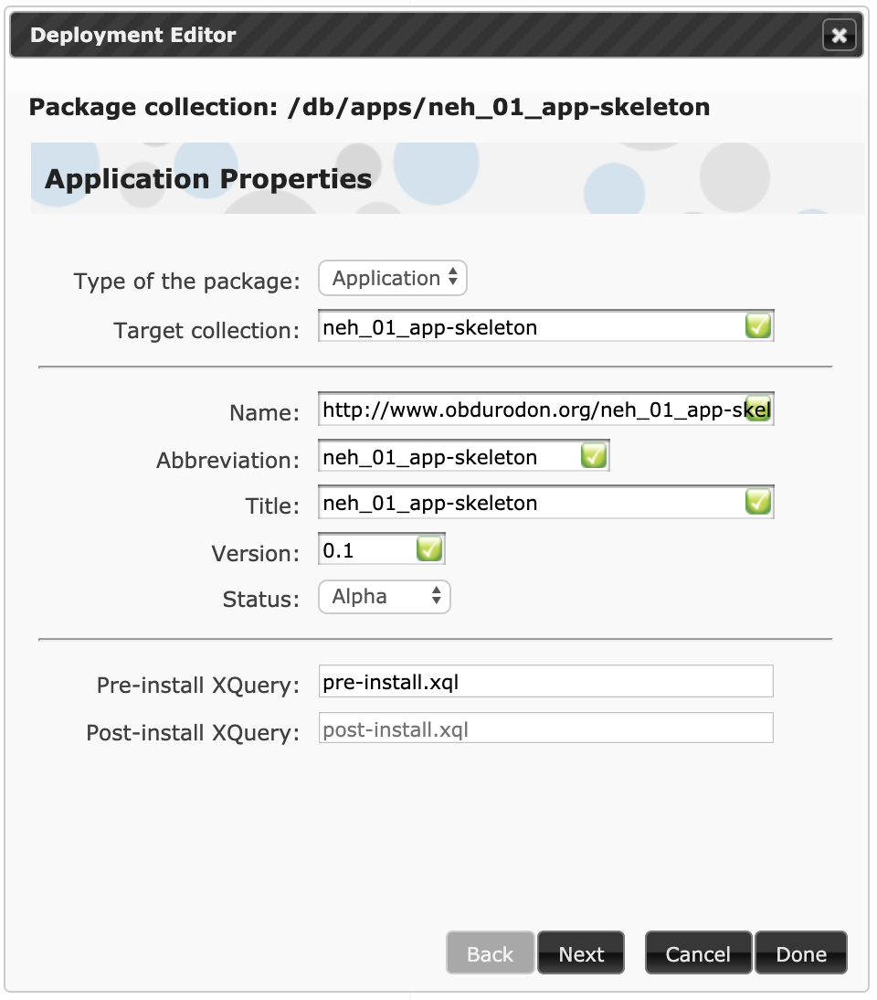
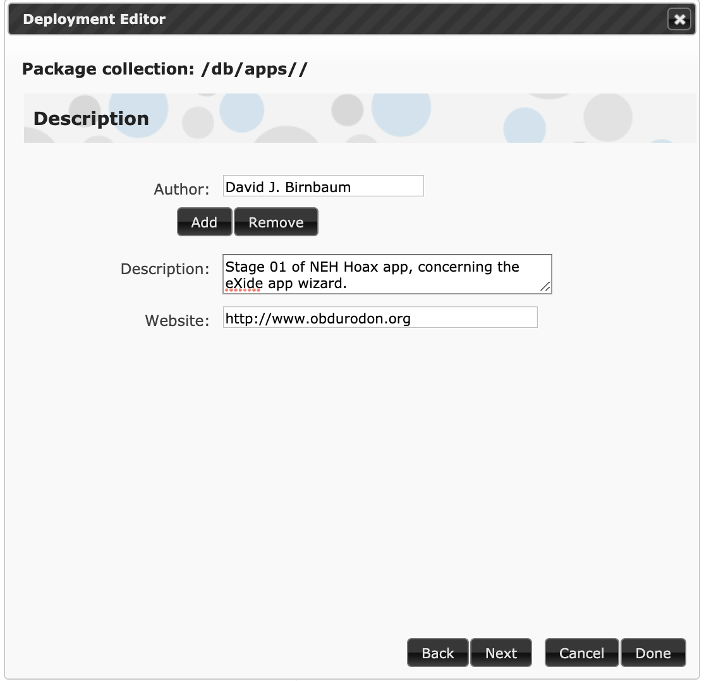
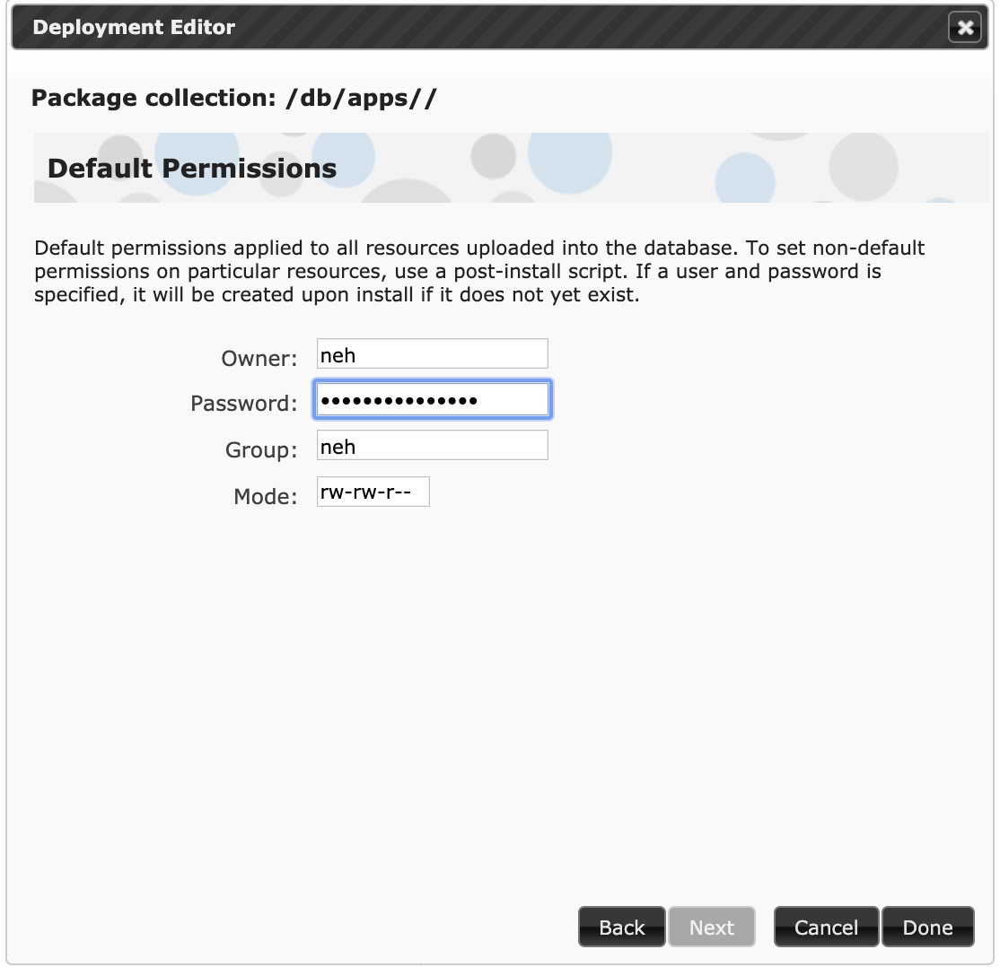
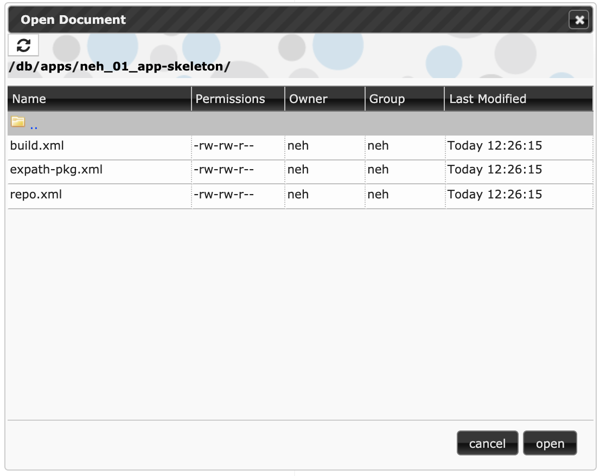
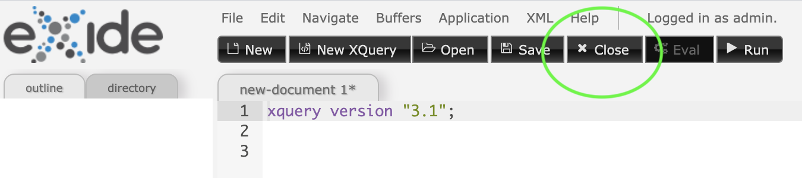

# App skeleton

Download links for *xar* packages

* There is no preconfigured starting point.
* Download link for [ending point of this stage](neh_01_app-skeleton-0.1.xar)

## Synopsis

The first task in creating an eXist-db app involves creating three housekeeping files that eXist-db needs in order to turn your eventual app into a package that you can distribute to other users for installation in their own systems. The easiest way to create these files is with the eXide app wizard. 

## About eXide

eXide is an IDE (‘integrated development environment’) that is distributed as part of eXist-db. It is used most commonly to edit resources inside the database (for example, to develop and test XQuery scripts); in this exercise we don’t edit any resources directly, but we’ll use eXide to initial our app.

## A note about terminology

eXist-db is organized hierarchically, like your file system, but instead of the terms *directory* and *file*, eXist-db uses the terms *collection* and *resource*, respectively. We’ll follow that usage below, and elsewhere in the Institute when speaking about eXist-db.

## Using the eXide app wizard to create an app skeleton

* Launch eXist-db, log in as userid *admin*, and launch eXide from the eXist-db dashboard.
* In the eXide menu bar, click on Application → New application. The completed first screen of the app-creation wizard will look as follows; see below the image for an explanation of the values we input.

* For **Type of the package** choose “Application” (the default). 
* For **Template** select *empty package*. The other options incorporate preconfigured CSS and JavaScript libraries; we’ll create our own CSS and JavaScript as needed.
* Under **Target collection** specify the name you would like the app root collection (that is, the collection that contains all app resources) to have inside eXist-db. The default installation location is inside the *apps* collection, and since we’ll specify just the collection name (without a path), the app will be installed into that default location, that is, into a collection at */db/apps/neh\_01\_app-skeleton*.
* The **Name** must be a URI; it does not have to point to an existing web page (it’s an identifier, and not a link). We use “http://www.obdurodon.org/neh\_01\_app-skeleton”. This value is used internally by eXist-db, and it should be unique.
* The **Abbreviation** will be used as the root of the filename for the eventual application package that you will use to distribute your app. For ease of file management, don’t use any spaces, and limit punctuation to dots, hyphens, and underscores. We use “neh\_01\_app-skeleton”, which means that our package will wind up with a filename like *neh\_01\_app-skeleton-0.1.xar*. In Real Life we might use “hoax”, in which case the eventual package filename would be *hoax-0.1.xar*.
* The **Title** will be displayed in the eXist-db dashboard, where users can launch the app inside their eXist-db server. We use *neh\_01\_app-skeleton*. In Real Life we would choose a user-friendly name, something like “Hoax”.
*  Leave the Version as “0.1” (default) and the Status as “Alpha” (default). Leave the **Pre-install XQuery** as “pre-install.xql” and the **Post-install XQuery** as “post-install.xql” (defaults). Click Next.
* On the next screen you can enter your name (as author), a longer description of the app, and your own web site. These fields are all optional. We recommend adding only one author (you can add others later; the wizard sometimes gets confused if you add more than one initially). Ours looks like the following:

Hit Next.

The following screen looks like:

In it we create a userid for the **Owner**, a password as the **Password**, and a groupid as the **Group**. Although it is possible to use existing credentials, we recommend creating a unique user, group, and password just for the app, and setting the name of the group to match that of the user. Don’t use any spaces in the userid and groupid, and limit punctuation to dot, hyphen, and underscore; the password can contain any character. It is not necessary to use an account with elevated privileges (e.g., admin, or any member of the dba [database administrator] group); we set the **Owner** and **Group** to “neh”. Choose an arbitrary strong password. Leave Mode as “rw-rw-r--” (default). Click Done.

* eXide will open its File manager view, which should look like the following:

This shows that the app was installed where we wanted it (inside a new */db/apps/neh\_01\_app-skeleton* collection) and that the three housekeeping files were created: *build.xml*, *expath-pkg.xml*, and *repo.xml*. You don’t need to interact with these files manually, but you can look at them, if you’d like, by double-clicking on them, which opens them inside eXide as regular XML files. When you’re done looking, you can close them with the Close button in the row of black buttons at the top of eXide:

## What next?

Your app skeleton contains only the three housekeeping files, but no real content and no real functionality. In the next stage ([neh\_02\_collection_hierarchy](neh_02_collection_hierarchy.md)) we will create some subcollections to hold different types of content for the app.