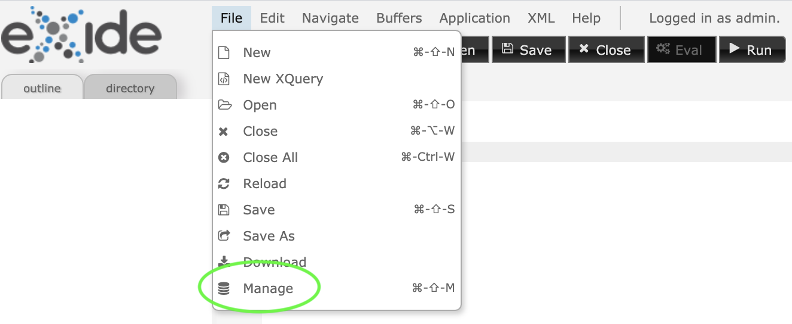
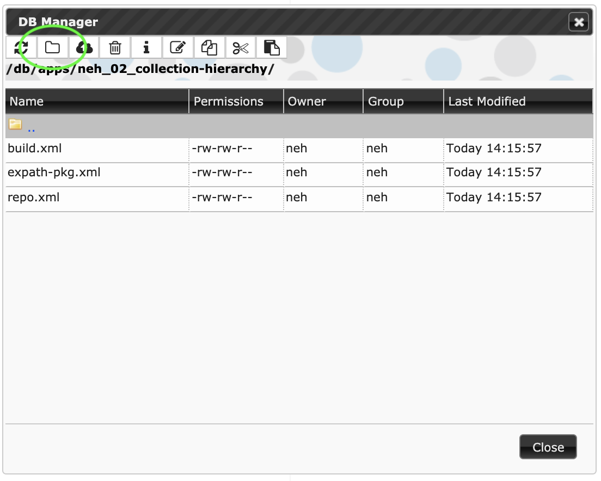
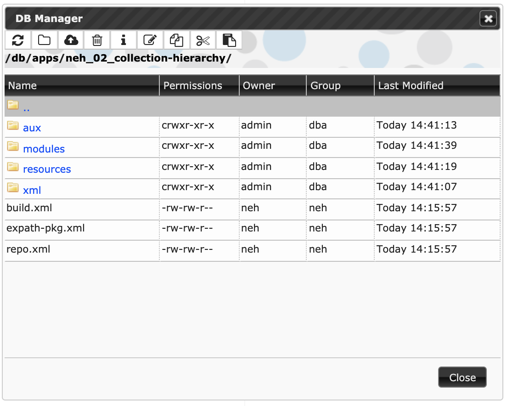

# Collection hierarchy

Download links for *xar* packages

* [Starting point](neh_01_app-skeleton-0.1.xar) (end of preceding stage)
* [Ending point](neh_02_collection-hierarchy-0.1.xar) (end of this stage)

## Synopsis

The main app collection should contain only housekeeping files, including the three that you created at the previous stage, and all edition content and code to interact with the edition should be organized hierarchically in subcollections.  The specific organization will vary depending on your edition resources; for example, only if your edition includes images will you need to create a collection for them. In this stage we will create those subcollections; in subsequent stages we will upload or create content for them.

## Reminder about terminology

eXist-db is organized hierarchically, like your file system, but instead of the terms *directory* and *file*, eXist-db uses the terms *collection* and *resource*, respectively. We’ll follow that usage below, and elsewhere in the Institute when speaking about eXist-db. This means that once you have uploaded a *file* from your file system into eXist-db, we will refer to it within eXist-db as a *resource*.

## How to create a subcollection

To create a subcollection in eXide, go to File → Manage, as in this illustration:

and navigate to inside the root collection of your app, where you will see the three housekeeping files you created in [Stage 1](neh_01_app-skeleton.md). Create a new collection by clicking on the icon that looks like a file folder:

## Subcollections for our edition

Create the following subcollections, which will hold different types of edition content:

### XML content resources

* *xml* This collection is for principal XML resources (that is, documents), such as poems in a poetry edition or manuscript descriptions in a manuscript catalog. An app might use a more generic subcollection name, such as *data*, or a more specific ones, such as *TEI* or *poems*. Our app will contain TEI XML transcriptions of Victorian ghost stories.
* *aux* This collection is for auxiliary XML documents, such as a master bibliography or master lists of persons (*prosopography* or, in TEI terms, “personography”) or places (*gazetteer* or, in TEI terms, “placeography”). We keep the auxiliary XML resources separate from the principal ones for ease of addressing, e.g., for searching all the stories at once without accidentally retrieving results from the Gazetteer.

### Non-XML resources

* *resources* This subcollection contains only other subcollections, separated by resource type. After you create the *resources* subcollection, double-click on it in the File manager (not on the name, which will edit the name; click somewhere else in the line) to move inside it. Then create the following:
    * *images* Static image resources, such as png or jpg.
    * *css* CSS resources. CSS ([Cascading Stylesheets](https://www.w3.org/Style/CSS/)) is used to style web pages. If you use webfonts (fonts that are provided by your app, so that users to do not have to install them separately), create a *fonts* subcollection under *css* (we do that here).
    * *js* JavaScript resources. JavaScript is used to make web pages interactive.

Other projects might include subcollections under resources for *pdf* or other non-XML content types.

You can move up from inside the *resources* subcollection by double-clicking on the first line (the two dots mean ‘parent collection’) or by single-clicking on the level you want to move up to in the collection path near the top of the File manager:

### Code

* *modules* Our app will incorporate different XQuery scripts for different types of functionality, e.g., for creating a reading view of a story, for creating a main page, for creating a reading view of the Gazetteer, for full-text search, etc. eXist-db calls these XQuery scripts “modules”, so we’ll use that as the name of this collection. Other apps might call the collection *xquery*.

Some apps use XSLT ([XSL transformations](https://www.w3.org/TR/xslt/all/)) as part of the processing *pipeline*, and if so, those scripts would go in their own subcollection. In our app we will use XQuery to perform that transformation that might alternatively have been performed with XSLT, we won’t need an *xslt* collection.

## The result

When you have created the subcollections, the view in the File manager should look as follows:

## What next?

You have added empty collections as placeholders for different types of app resources. In the next stage ([neh\_03\_uploading-xml](neh_02_uploading-xml.md)) we will upload XML files into the correct collection and access them directly from inside a web browsesr.