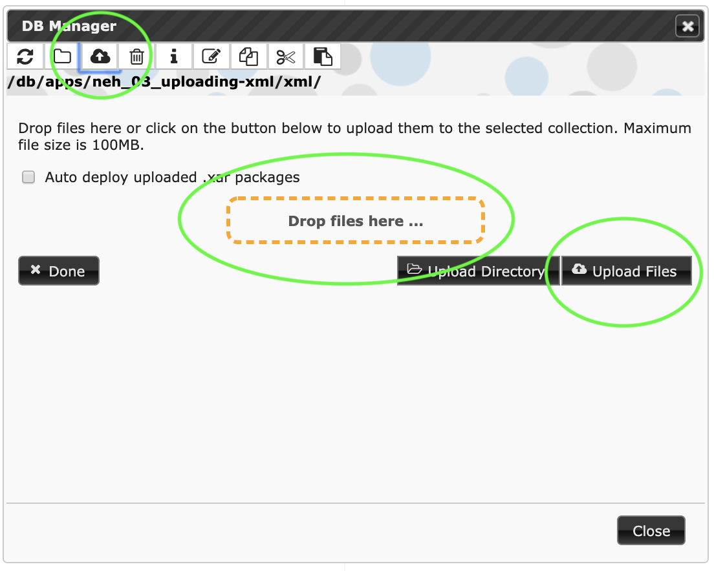
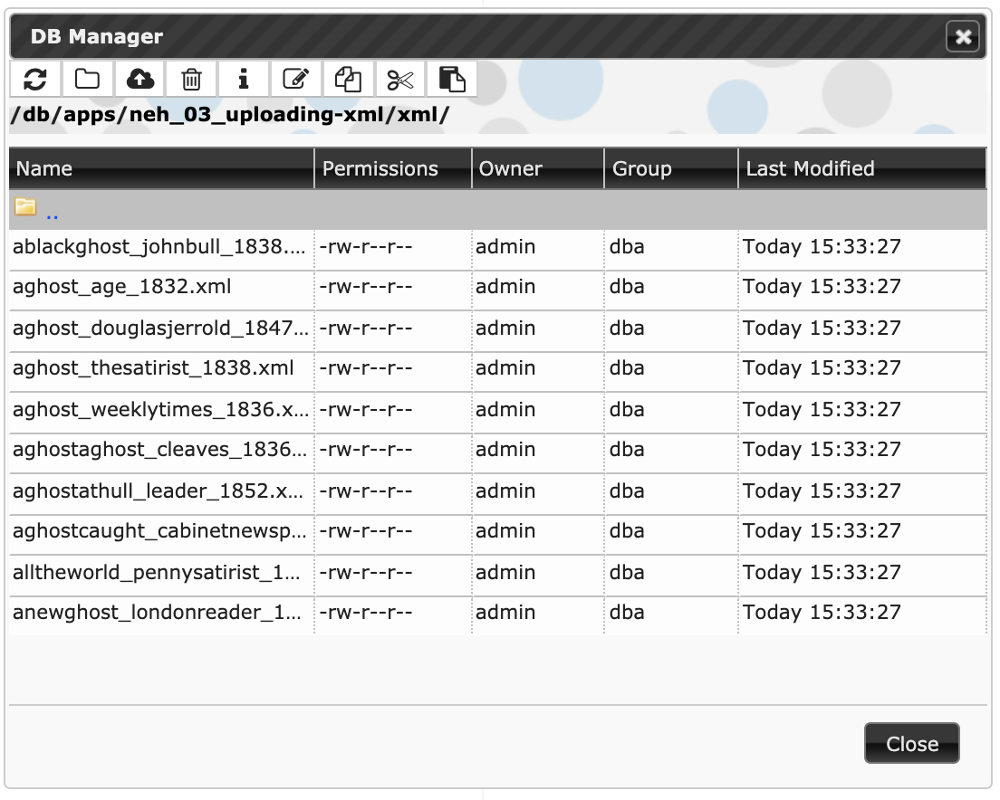
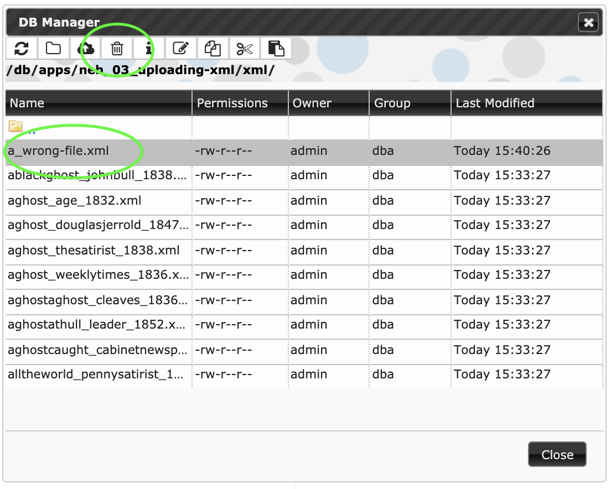
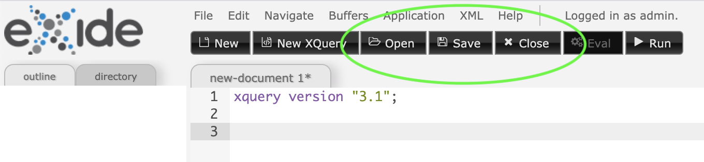
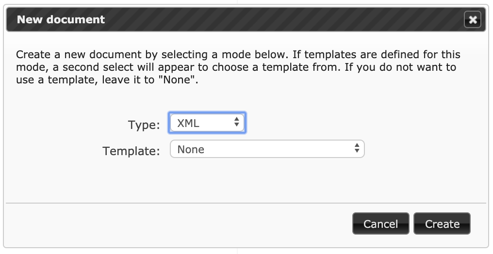
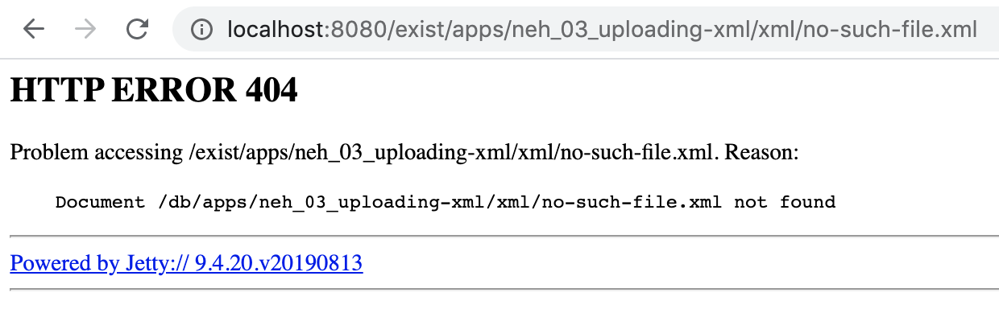
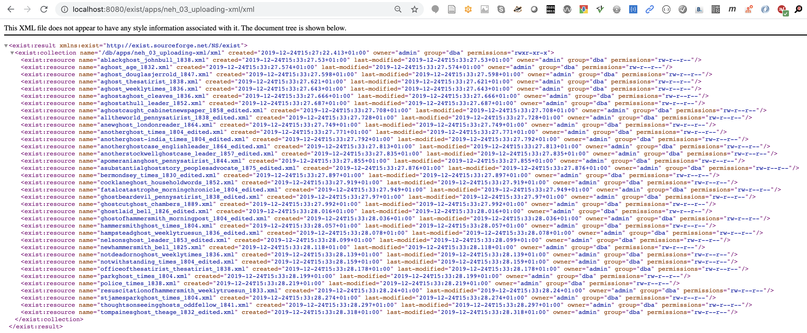

# Uploading XML

Download links for *xar* packages

* [Starting point](neh_02_collection-hierarchy-0.1.xar) (end of preceding stage)
* [Ending point](neh_03_uploading-xml-0.1.xar) (end of this stage)

## Synopsis

In this stage we upload the XML files for our ghost stories to the *xml* subcollection that we created in the [previous stage](neh_02_collection-hierarchy.md). We will then explore the new XML resources in eXide and through a web browser.

## Another note on terminology

We previously noted that eXist-db uses the terms *collection* and *resource* to correspond to what on a file system would be called *directory* and *file*. eXist-db also uses the term *document* to refer to an XML resource (but not typically to refer to XQuery or CSS or other non-XML resources). We will also use the term *document* in this meaning.

## Uploading files

To upload files into eXide, launch eXide, open the File manager and navigate to the *xml* subcollection of your app. Once you are there, click on the third icon from the left, the one that looks like a cloud with an up-arrow superimposed on it, to open the file upload dialog:

You can upload files by dragging and dropping them onto the “Drop files here” landing site (using your graphical file system browser) or you can click on Upload files and navigate to the files you want. (You can also upload a directory, with all of its contents, but in this case we just want to upload individual files.)

Use either of the upload methods to upload the XML files for the edition. When the upload finishes, click Done and you’ll see a list of new documents inside eXist-db:

If you upload the wrong thing, or upload something to the wrong location, you can remove it from the collection by selecting it in the file manager and then clicking the trashcan icon, the fourth from the left, which deletes a resource:

## Opening XML documents in eXide

Your XML documents are now inside eXist-db. You can edit them using eXide by opening the File manager, navigating to the correct location, and double-clicking on the file you want to open. Alternatively, you can click on the black Open icon in the bar at the top of eXide and navigating inside your collection hierarchy from there. If you edit a file in eXide and want to save your changes, use the Save icon. To close the file, click the Close icon:

You can also use eXide to create new XML documents, which you can then save into eXist-db. To do that, click on the New icon (not New XQuery), and when the new-file dialog opens, set the Type to XML from the drop-down list, and leave the Template set to None:

In this project, though, we’ll edit our XML externally and upload it.

## Accessing XML documents using a web browser

By default, once your XML documents are inside eXist-db, they are directly accessible through a web browser. With eXist-db running on your laptop, which is not accessible from the Internet, only you can access them with a browser, but if you put them on a public web server, anyone can read them. Providing access to others is, after all, the main reason of publishing an edition on the Web. You can set permissions within eXist-db to restrict access by requiring password authentication, both in general and on specific resources, and you’ll normally want to do that, since publishing your edition does not mean exposing *everything* inside your database to everyone. We’ll discuss security configuration later, but for now, running on our laptops, we’ll accept the default and leave things accessible. Your app will probably not serve raw XML documents by default, although it might make them available to those who want them, including for repurposing in conformity with the Reuse part of the [FAIR Guiding Principles for scientific data management and stewardship](https://www.go-fair.org/). 

To access an XML document inside eXist-db (running on your local machine with default settings) using a web browser, navigate to *http://localhost:8080/exist/apps/neh\_03\_uploading-xml/xml/police\_times\_1838.xml*, replacing our “neh\_03\_uploading-xml” with the name of your app in your eXist-db instance (e.g., “hoax”) and the last part, “police\_times\_1838.xml”, with the name of any file in the collection. Your browser will render the XML directly. How it looks will depend on how the browser chooses to render XML; desktop and laptop browsers will usually show the XML with markup, while Safari on iOS shows all of the textual content as if it were one big paragraph, with no markup or newlines.

If you ask for a file that doesn’t exist, you’ll get an error message:

If you ask for a collection, rather than a document, you’ll get a directory listing of the collection, with some eXist-db-specific added:

The collection listing is not navigable, that is, you can’t click on a document name to open it in the browser.

## Optional (advanced)

If you have installed a command-line tool for accessing resources on the Internet, it will also have access to the contents of your eXist-db database. For example, if you have installed [curl](https://curl.haxx.se/), you can run `curl http://localhost:8080/exist/apps/neh_03_uploading-xml/xml/police_times_1838.xml` in a command-line terminal and it will flashs the contents of the file to your screen (and you can tell curl to save it to a file instead, of course). Or, if you have installed [wget](https://www.gnu.org/software/wget/), you can run `wget http://localhost:8080/exist/apps/neh_03_uploading-xml/xml/police_times_1838.xml` and it will save a copy of the file to your local file system. 

We will return to ways of accessing app contents outside the app interface, why users might want to do that, and why you might want to support it as a developer, in a later session devoted to APIs (application program interfaces).

## What next?

You have uploaded XML documents into your database and explored them using eXide and through a web browser. In the next stage ([neh\_04\_query-rewriting](neh_04_query-rewriting.md)) we will begin look at how eXist-db makes your information available within an application interface, and not just as individual raw XML documents.