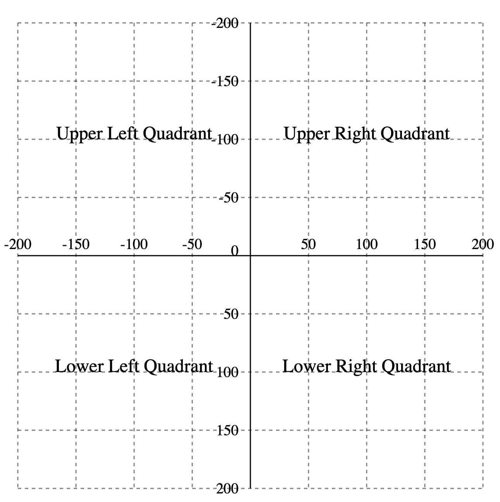
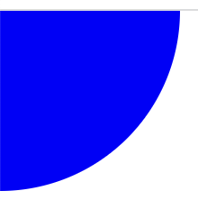
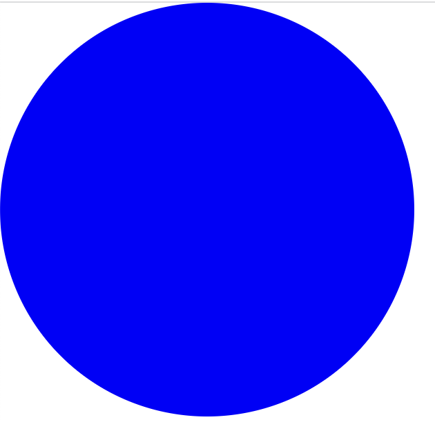
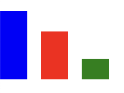

# Getting started with SVG

## The Y axis is upside down



## X and Y positions default to 0,0

```
<svg xmlns="http://www.w3.org/2000/svg" width="300" height="300">
    <circle r="100" fill="blue"/>
</svg>
```



Eek! Where’s the rest of the circle?

## Use the `viewBox` attribute to move the image

1. Spell `viewBox` correctly! 
1. The `viewBox` attribute takes four whitespace-separated values:  
    1. minX (leftmost X position)
    1. minY (topmost Y position)
    1. width (always positive)
    1. height (always positive)

Draw where the arithmetic is easy and move with `viewBox`:

```
<svg xmlns="http://www.w3.org/2000/svg" width="300" height="300"
    viewBox="-50 -50 100 100">
    <circle r="100" fill="blue"/>
</svg>
```



## Bar chart with heights of 50, 35, and 15

Drawing it in positive space (lower right quadrant) makes for odd arithmetic:

```
<svg xmlns="http://www.w3.org/2000/svg" width="300" height="300">
    <rect x="0" y="50" height="50" width="20" fill="blue"/>
    <rect x="30" y="65" height="35" width="20" fill="red"/>
    <rect x="60" y="85" height="15" width="20" fill="green"/>
</svg>
```



Eek! Where did 65 and 85 come from?

## For easier arithemtic, draw in the upper right quadrant

Use **negative Y values with *matching* positive heights**, so that all bars grow down to the y=0 position …

```
<svg xmlns="http://www.w3.org/2000/svg" width="300" height="300">
    <rect x="0" y="-50" height="50" width="20" fill="blue"/>
    <rect x="30" y="-35" height="35" width="20" fill="red"/>
    <rect x="60" y="-15" height="15" width="20" fill="green"/>
</svg>
```

Now the 35 bar has only 35 (no 65) and 15 has only 15 (not 85), but …

… this won’t be visible until we move it down with viewBox:

```
<svg xmlns="http://www.w3.org/2000/svg" width="300" height="300"
    viewBox="0 -100 100 100">
    <rect x="0" y="-50" height="50" width="20" fill="blue"/>
    <rect x="30" y="-35" height="35" width="20" fill="red"/>
    <rect x="60" y="-15" height="15" width="20" fill="green"/>
</svg>
```

## `viewBox` can scale an image

* See <http://dh.obdurodon.org/coordinate-tutorial.xhtml> for brief information about how to scale with `viewBox`.
* See Sara Soueidan’s [Understanding SVG coordinate systems and rransformations (Part 1) — The viewport, viewBox, and preserveAspectRatio](https://www.sarasoueidan.com/blog/svg-coordinate-systems/) for detailed information about `viewBox` and more.

